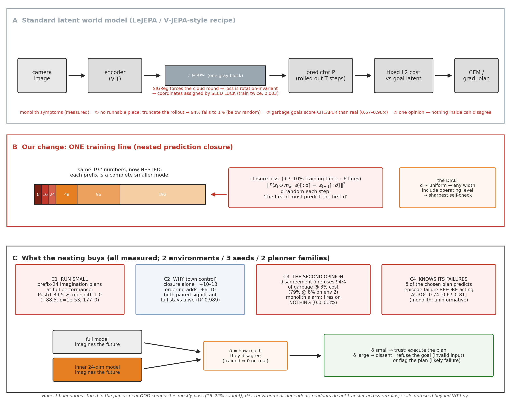
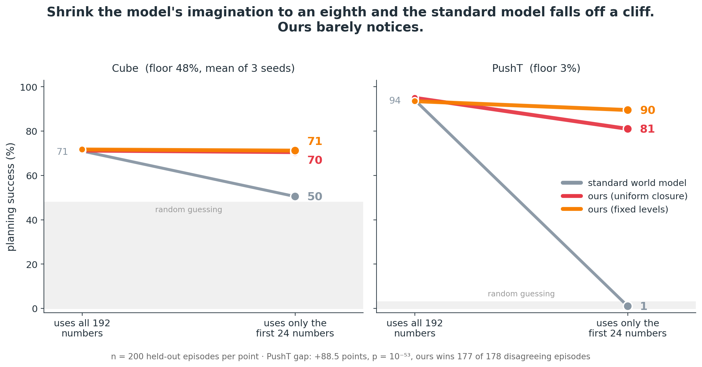
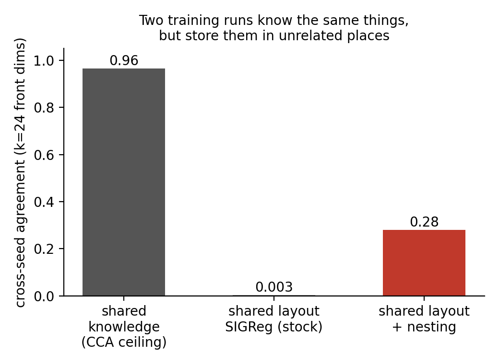
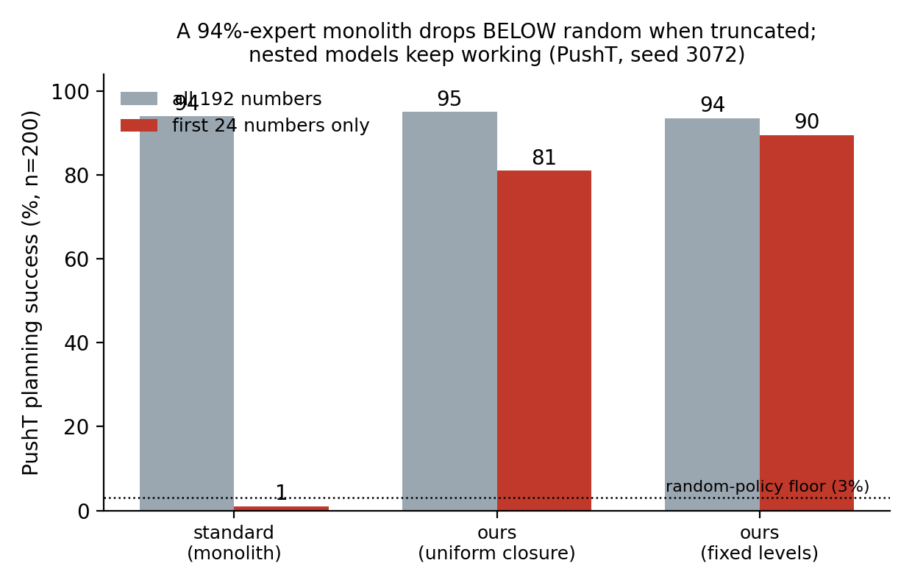
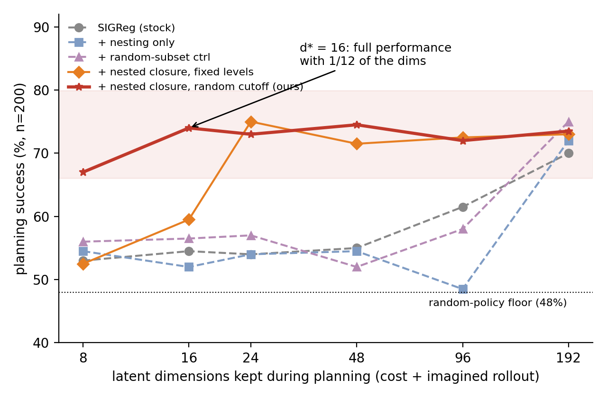
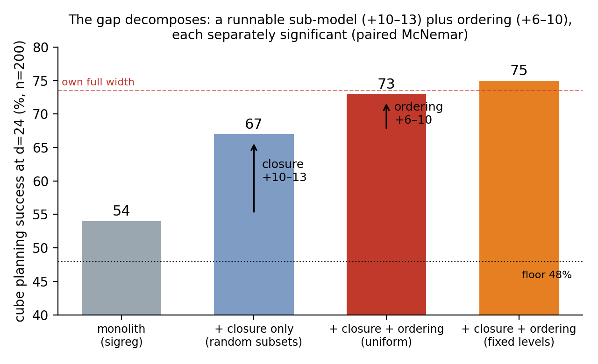
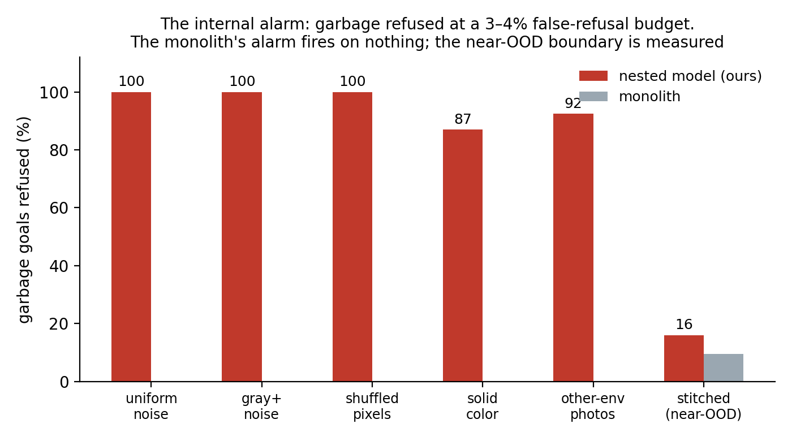
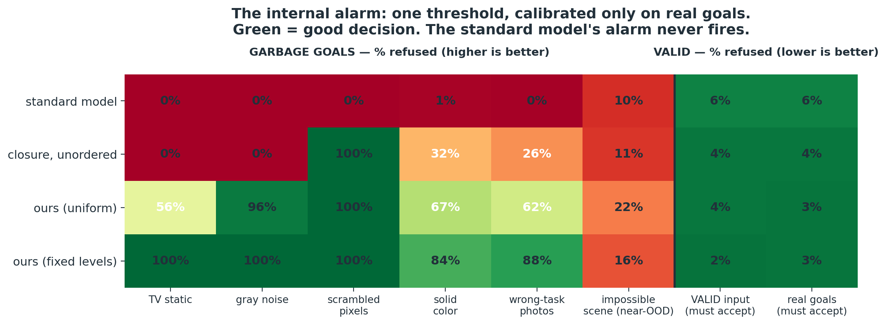
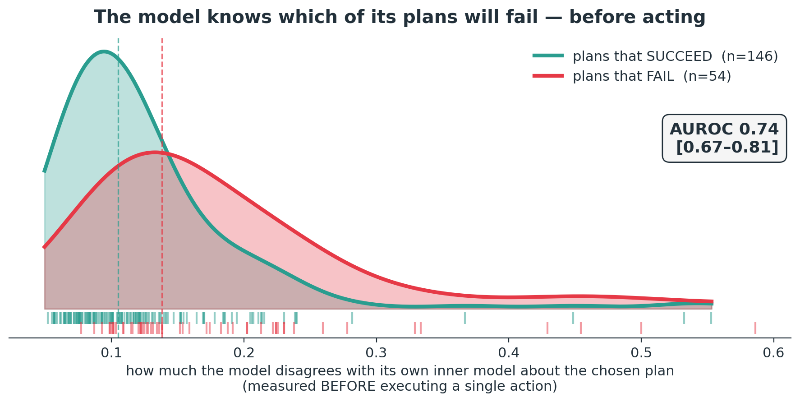

# Co-author review document: Nested world models that can doubt themselves

> **The story in 60 seconds (plain language):** A robot's world model squeezes each
> camera image into 192 numbers and plans by imagining futures. We found that these
> models are *monoliths*: nobody decides what each number means (train the same model
> twice and the filing is pure coin flip), no smaller model exists inside one (a 94%
> expert drops below random when you shrink its imagination), and it cannot doubt
> itself (it rates TV static as an easier goal than a real photo). One added line of
> training turns the monolith into Russian dolls: complete smaller models nested
> inside the big one. The dolls are real - the small one plans as well as the whole
> thing - and dolls can do what a loner cannot: **disagree**. When the inner doll and
> the full model imagine different futures, the model has caught its own nonsense: it
> refuses fake goals and flags its own doomed plans before acting.
>
> Prefer the fully plain version? Read [SIMPLE_STORY.md](SIMPLE_STORY.md) first
> (5 minutes, no jargon). The rest of this document is the technical walkthrough
> with every number and control.


*Status: experimental campaign ~complete (3 cells pending, listed in §9). Target: ICLR
(abstract ~Sep 19). This doc is the full technical walkthrough for review — every
claim carries its number and its job trail. Raw evidence: `analysis/docs/results/`.*

---

## 1. One-paragraph summary

Latent world models trained with the LeJEPA/SIGReg recipe plan by comparing 192-number
embeddings with a fixed distance. We show these models are *monoliths*: their
coordinates mean nothing in particular (train twice: 96.5% shared information, 0.003
shared layout), no runnable sub-model exists at any width (a 94%-success PushT expert
drops to 1% — below the 3% random floor — when its imagination is truncated to 24
numbers), and they cannot doubt themselves (garbage images score as *easier* goals than
real ones, 0.67–0.98x). One auxiliary loss — nested prediction closure, honestly
described as nested dropout applied to the dynamics — changes the kind of object the
model is: it now contains complete smaller models of itself. We show (i) the inner
models genuinely work (masked-24 planning at 69–89.5% vs monolith 1–54%, on two
environments, three seeds, two planner families, with the gain decomposed into
closure +10–13 and ordering +6–10 by a dedicated control), and (ii) the family can
*disagree*, and disagreement is an intrinsic validity signal: it refuses 94% of the
garbage goals the score prefers (at 3% false-refusal), transfers to the second
environment (79%@8%), and predicts the model's own plan failures before acting
(AUROC 0.74). The monolith supports none of this at any price.

---

## The whole paper in one diagram



*Band A: the standard pipeline and its three measured symptoms. Band B: the one-line
change and the dial. Band C: the four measured payoffs and how the internal
disagreement signal works. This is the candidate contribution figure for the paper
(source: `analysis/src/figures/fig2_schematic.py`; a designer/draw.io pass can polish
it for camera-ready).*

### The result in one image



## 2. Background (what everything is built on)

**The architecture.** Encoder `f: image -> z in R^192` (ViT-tiny, trained from
scratch), latent predictor `P: (z_t, action) -> z_{t+1}` (transformer, autoregressive
rollout, history 3), trained with latent MSE plus **SIGReg** (LeJEPA, Balestriero &
LeCun 2025): a sketched hypothesis test forcing the embedding distribution toward an
isotropic Gaussian. This is the current heuristics-free anti-collapse recipe, and it
comes with a theorem: isotropy minimizes downstream risk for readouts that are re-fit
per task. We verified the theorem holds on our checkpoints — this work locates a
failure *outside* its scope, not a flaw in it.

**Planning.** Zero-shot: encode a goal image, search action sequences (CEM: 300
samples, 30 iterations; also a gradient-based planner), roll each candidate through P,
score by squared distance between the imagined final latent and the goal latent, every
coordinate weighted equally. The planner is a **fixed-metric consumer** — it never
re-fits anything.

**Evaluation discipline.** OGBench cube pick-and-place (floor: 48% — random actions
succeed half the time at this offset) and PushT (floor: 3.0% — 97 points of dynamic
range). n=200 held-out start/goal pairs, deterministic splits, epoch-10-pinned
checkpoints. All cross-arm comparisons are **paired** (identical 200 episodes; exact
McNemar + 20k bootstrap). Per-episode outcome arrays for all 57 evaluations are
archived (`results/cube_episode_successes.json`).

---

## 3. Finding 1: the monolith (three symptoms, one cause)

### 3a. The coordinates are assigned by luck

Both training losses are provably invariant to rotating the latent space (L2 and the
isotropic target are rotationally symmetric — proofs in `MATRYOSHKA_MATH.md`,
independently reviewed). So the objective cannot prefer a basis. Does anything else?
Train the identical model twice, changing only the seed; encode the same held-out
frames with both:



- **Shared knowledge: 96.5%** (CCA — a fitted linear map translates one run's latents
  into the other's almost losslessly).
- **Shared layout: 0.003** (same-index coordinate agreement; 0 = coin flip).
- Frame metrics (added after review): raw per-coordinate correlation at the null for
  every arm; the best orthogonal map inside the prefix recovers only ~40% of the
  cross-seed discrepancy for stock models. **No shared coordinate frame exists.**

### 3b. No runnable sub-model exists inside

Two dissections localize what the luck-filing costs. Truncating only the *score* to 24
of 192 coordinates costs nothing (70.5 vs 70.0 on cube) — SIGReg smears content so
redundantly that any two dozen coordinates can serve a static comparison. But
truncating the *imagination* (zero z[24:] at every predictor input and output) is
fatal:



A model that succeeds 94% of the time with all 192 numbers succeeds **1%** — below
random — with its best 24. You can *read* a piece of a monolith; you cannot *run* a
piece of one: every coordinate's dynamics depends on all the others. (Cube: 70 -> 54,
floor 48, three seeds. The below-floor behavior on PushT means the broken imagination
actively steers away from goals; diagnostic in flight, §9.)

### 3c. It cannot doubt itself

Garbage goal images — uniform noise, gray mush, pixel-shuffled frames, solid colors,
photos of a *different environment* — receive **lower** planning cost than real goals
(0.67–0.98x, all 8 checkpoints x 5 families). Isotropy has no "outside": OOD inputs
funnel toward the latent mean, where everything is close. And the monolith has exactly
one opinion per input — there is no internal quantity that could flag the problem.

---

## 4. The method (deliberately modest)

One auxiliary loss. At each training step, draw a cutoff d; require the first d
coordinates, alone, to predict the first d coordinates of the future:

```
L_closure = || P(z_t * mask_d, a)[:d]  -  z_{t+1}[:d] ||^2      d ~ U{1..191}
```

~6 lines of code, **+6.8–9.8% wall-clock** (measured), full-width behavior unchanged,
bit-identical to stock when disabled. Mechanically this is **nested dropout (Rippel
et al. 2014) transplanted to the dynamics** — we claim no loss novelty. It is, however,
the only term that is *not* rotation-invariant, so training must commit to an ordering,
and the preferred ordering front-loads self-predictive (slow, task-deciding) content.
The cutoff distribution is a **dial**: fully random -> maximal width-flexibility;
include your operating level (e.g. {24,48,96}) -> sharpest self-consistency at that
level. Both settings are reported everywhere; the trade-off is measured (§6).

---

## 5. Finding 2: the inner models are real

### 5a. Planning at 1/8th width, and where the gain comes from



Cube (floor 48): stock models sit at 49–57% for every d < 192; ours plans at full
performance from d=16 (74.0 vs 73.5 own full width, p=1.0). Replicated on **three
seeds** (monolith masked-24: 54.0 / 51.0 / 46.5; ours: 69–75) and on **PushT**
(+88.5 points over the monolith at masked-24; McNemar p = 1e-53; in the 178 episodes
where they disagree, ours wins **177–0**). Same pattern under a **gradient-based
planner** (monolith 50/51/50, ours 71.5/72.0) and across a 10x CEM budget sweep — not
a solver artifact.

The obvious objection — "you trained truncated, so truncated evaluation is just
train-test match" — is answered by decomposition with a dedicated control (closure on
*random subsets*: mask-robust, order-free):



Having *any* runnable sub-model is worth +10–13 points (p <= 5.4e-4); *ordering* the
sub-models adds +6–10.5 more (p = .036 to 1e-4). Both effects real, separately
significant, each with its own arm.

### 5b. Genuine nesting, not shrinkage — and the task moves to the front

The coordinates past the cutoff still carry full information about the present (suffix
readout R^2 = 0.989 = full width) — the model is nested, not hollowed. And task
content concentrates: the block's position reads from the **first 8 coordinates at
R^2 0.43**, vs 0.03–0.10 for stock and 0.33 for unordered closure. A second control
dissociates mechanism: ordering *without* the prediction term produces the best
goal-discriminating prefix we measured (0.90 AUROC) yet still collapses when planning
— static geometry does not buy runnable dynamics; the trained closure does.

---

## 6. Finding 3: the family can disagree — an intrinsic validity signal

Roll the full model and its level-24 inner model under the same actions from the same
start. On real states they agree (the loss trained exactly that). On garbage
embeddings, nothing ever trained agreement — and they diverge. That disagreement
(delta) is an internal signal with no monolith counterpart:

### 6a. Refusing the garbage the score prefers

Calibrate a threshold at the 95th percentile of delta on 128 held-out *real* goals
(no garbage seen), then gate a disjoint test set:





- Ours (fixed-level arm): **94.4% of garbage refused at 3.0% false-refusal**
  (held-out, audited). Transfers to PushT: 78.8% @ 8.0%.
- The monolith: **0.0–0.3% refused** — its delta carries nothing, at any threshold.
- Unordered closure: 29–32% — ordering matters here too.
- Baselines (Mahalanobis, kNN-10, a two-seed ensemble; implemented fairly after our
  own audit — Ledoit-Wolf, split-half calibration; rerun in flight): none reached the
  alarm's operating point in our runs. Sharpest cell: on color-matched pixel-shuffled
  frames, **kNN detects 0%, the alarm 100%** — dynamics-consistency sees what encoder
  geometry cannot.
- **Measured boundary, stated with its number**: photometrically-real but physically
  impossible composites (stitched halves of two real frames) mostly pass (16–22%
  refused). The alarm's envelope is off-manifold garbage. Conversely, on *valid*
  perturbed inputs the alarm stays at base-rate false-refusal (2.5–3.5%) where naive
  gates false-alarm at 19–27% — selective, not just sensitive.

### 6b. Predicting its own failures before acting

During completely normal full-width planning, log the chosen plan's cross-level
disagreement; correlate with the episode's outcome:



Plans the model is internally inconsistent about are the plans that fail: AUROC
**0.74 [0.67–0.81]** (bar of 0.65 pre-registered). The monolith's signal is
uninformative in the registered direction (0.296 — inverted; a sign-flipped detector
would be test-set selection).

---

## 7. What we predicted and got wrong (kept, on purpose)

| falsified prediction | what the data said |
|---|---|
| readouts transfer across retrains once ordering exists | negative R^2 for ALL arms — partial subspace consistency is not a shared frame (the frame metrics explain exactly why) |
| MRL-style retrieval speedups transplant | random subsets retrieve as well as prefixes — SIGReg's smear makes any subset retrieval-capable |
| coarse landscapes need less search budget | not significant (one suggestive cell, not claimed) |
| plus three earlier mechanistic hypotheses | (ESS/autocorrelation; latent "repulsion" = linear-probe artifact; junk-slots story — corrected to redundant smear) |

Six falsifications, three adversarial audit waves (which caught, among other things,
three bugs that made our *baselines* unfairly weak — fixed, fair reruns in flight),
and one simulated 4-persona ICLR panel run twice: scores moved 4/5/5/5 -> 6/7/6/7 as
the named gaps were closed.

---

## 8. Honest limitations (each with its number)

1. **The score itself still prefers garbage** (0.67–0.98x) — the alarm detects what
   the cost cannot, but we have not yet wired refusal into a closed-loop agent
   (composition table pending, §9).
2. **Near-OOD passes the alarm** (16–22% caught) — the envelope is off-manifold junk.
3. **d\* is environment-dependent**: the flat-width property is cube-specific; on
   PushT the uniform arm pays -14 at masked-24 vs its own full width (d\* > 24 there;
   width curve in flight).
4. **The sharpest alarm needs a designed operating level** (fixed-level arm: gate 94%,
   confidence 0.74; uniform arm: 76%, 0.60). Framing owns this; a multi-level
   aggregated alarm for the uniform arm is a proposed fix, untested.
5. **Scale**: ViT-tiny, 192 dims, two toy manipulation environments, 2–3 seeds.
   No frozen-pretrained-encoder condition (staged; the identifiability argument is
   architecture-independent, the measurements are not).
6. PushT's dramatic numbers are single-seed today (second seed training now).

---

## 9. Open cells (all in flight, none blocks the story)

| item | job | expected |
|---|---|---|
| fair-baseline reruns (Ledoit-Wolf, split-half) | 90627/90628 | final baseline table; claims rescope if baselines recover |
| second PushT seed (3 arms) | 90631-39 | de-single-seeds the 94->1 headline |
| native-24 monolith ("why not train small?") | 90322-25 | the size-question answer; a 24-dim monolith has no inner model and no alarm regardless |
| PushT width curve (d=48/96) + below-floor diagnostic | 90630 | locates PushT d*; explains worse-than-random |
| 3-seed-pair frame metrics (Fig-1 CI) | 90629 | error bars for Figure 1 |
| goal-stream closed-loop table | (compose from archived arrays) | end-to-end gated-agent vs ungated-agent |

## 10. Questions for you (the co-author)

1. **Framing**: findings-paper (three numbered findings, self-consistency as the
   technical spine, metaphors as garnish) vs the narrative arc? Current plan:
   findings-paper. Object now if you disagree.
2. **Headline**: the PushT collapse (94->1, p=1e-53) vs the alarm (94% refusal)?
   Current plan: collapse is Finding 1's exhibit; the alarm is the payoff.
3. **The dial contradiction** (novelty leans level-free; reliability needs levels):
   own it, or hold submission for the multi-level-alarm experiment?
4. **Venue**: ICLR main + world-models workshop in parallel; TMLR as the fallback.
   Sanity-check this.
5. Anything in §8 you would NOT ship as a limitation?

## 11. Reproducibility map

Code: probes in `analysis/src/` (each result doc names its script + job id).
Training: `train.py` + `/scratch/.../logs/*-arm-train.sbatch` (arm cases documented).
Evals: `analysis/src/eval_drift.py` (prefix masking, confidence logging).
Evidence: `analysis/docs/results/*.md` (pre-registrations with verdicts appended,
never rewritten), per-episode arrays in `results/cube_episode_successes.json` (57
evals), probe JSONs archived per wave. Audits: `results/REVIEW_*.md` (5 waves).
Narrative for non-experts: `THE_SIMPLE_STORY.md`. Experiment index: `PROGRESS_SUMMARY.md`.
